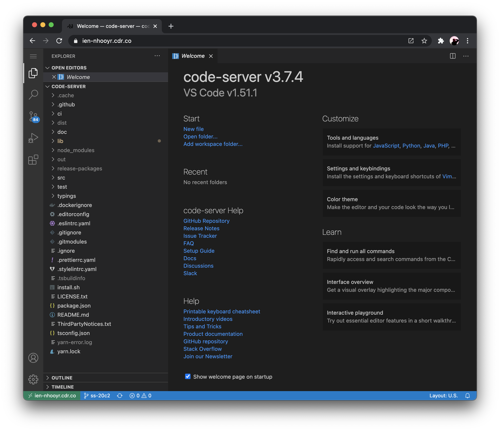
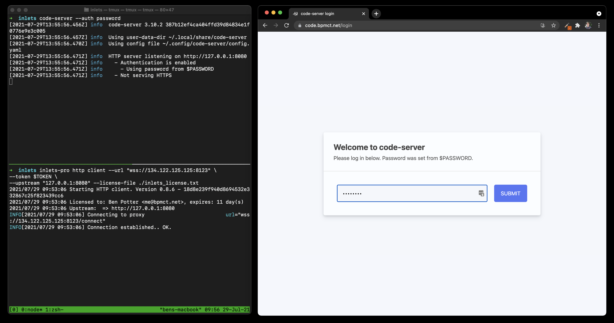

for coder.com/blog:

# Guide: Access your VS Code environment remotely (web and SSH)

Keeping the same development environment across multiple devices has historically been trickier than it seems. Remote development has always been possible and

- code-server: access VS Code in the web browser, runs on a remote machine
- VS Code Remote SSH: connect and develop on a remote machine with a VS Code extension

So, why not use both?

1. connect with code-server from any device (iPad, Grandma's computer, smartphone, etc)
2. connect with VS Code Remote from your commonly-used devices (desktop, laptop, etc)

And, you settings and extensions can be synced across both :)

## Step 1) Install/run code-server

[code-server](https://github.com/cdr/code-server) is an open source project that hosts VS Code in the web browser. It can be installed on a remote server or locally (to make your local environment remote).

Use code-server's install script:

```bash
# dry run:
curl -fsSL https://code-server.dev/install.sh | sh -s -- --dry-run

# install:
curl -fsSL https://code-server.dev/install.sh | sh
```

Run as a docker container:

```bash
# note: running code-server as a Docker container
# will not expose your local projects and settings.
# 
# to persist any dependencies installed use a custom image,
# mount volumes, or add them to the home directory

mkdir code-server && cd code-server
docker run -it --name code-server -p 127.0.0.1:8080:8080 \
  -v "$PWD:/home/coder" \
  -u "$(id -u):$(id -g)" \
  -e "DOCKER_USER=$USER" \
  codercom/code-server:latest
```

## Step 2) Install/enable a local SSH server

If you want to access your dev environment over VS Code Remote from another device, enable SSH. Most operating systems have a built-in SSH server that just has to be enabled.

- [MacOS](https://support.apple.com/guide/mac-help/allow-a-remote-computer-to-access-your-mac-mchlp1066/mac)
- [Windows Server 2019 and Windows 10](https://docs.microsoft.com/en-us/windows-server/administration/openssh/openssh_install_firstuse)
- Linux: Use your package manager of choice :)

## Step 3) Expose to the internet

Once you have code-server and/or VS Code Remote installed, it's time to make them accessible remotely. Normally, this would require either port forwarding, a VPN,

**Option 1: code-server —link**

If you'll only be connecting remotely from the web browser, you can use the  `code-server --link` flag to get a public tunneled URL. Instead of authenticating with a password, you'll be prompted to log in with GitHub. Future logins with the tunneled URL will verify your GitHub account.

You can also add `link: true` to the code-server's config file to launch with —link by default.



Note: code-server —link will not proxy your SSH server. Other options, such as inlets can do this for you.

**Option 2:** Self-host a tunnel with [inlets.dev](http://inlets.dev) (code-server and SSH)

Inlets PRO is a self-hosted tunneling software with abstractions that make it simple to expose local services to the internet. Inlets is not free, so you'll need a license for inlets PRO. It is $20/mo but you can request a trial license. Since this is also a self-hosted solution, you'll need access to a remote server and a domain name. The [inletsctl](https://github.com/inlets/inletsctl) tool makes it easy to launch a cloud server with inlets pre-installed.

If you already have a server, you can use the [inlets documentation](https://docs.inlets.dev/#/?id=inlets-pro-reference-documentation) to install & configure inlets-pro. In this example, I use `inletsctl` to deploy a server that will cost roughly $5/mo on DigitalOcean. The inlets docs has [examples for different providers](https://docs.inlets.dev/#/tools/inletsctl?id=examples-for-specific-cloud-providers) that work great, jus be sure to include the LetsEncrypt flags.

```bash
inletsctl create --provider digitalocean \
 --access-token DIGITALOCEAN_ACCESS_TOKEN \
 --region nyc1 \
 --letsencrypt-domain code.bpmct.net \
 --letsencrypt-email me@bpmct.net \
 --letsencrypt-issuer prod
```

Be sure to replace the domain, email, and optionally the [region](https://status.digitalocean.com/). Also include a [DigitalOcean access token](https://docs.digitalocean.com/reference/api/create-personal-access-token/) from your account.

After the server is created, `inletsctl` will return the server's IP address. Add a DNS A record for your custom domain to the IP. Inlets will also give an example command on how to start a tunnel. Change the `—upstream` flag to the where code-server is hosted (usually 127.0.0.1:8080). Also, this is where add your [inlets license](https://docs.google.com/forms/u/1/d/e/1FAIpQLScfNQr1o_Ctu_6vbMoTJ0xwZKZ3Hszu9C-8GJGWw1Fnebzz-g/formResponse).

```bash
inlets-pro http client --url "wss://[server IP]:8123" \
 --token [token] \
 --upstream "127.0.0.1:8080" \
 --license ./inlets_license.txt

Starting HTTP client. Version 0.8.6 - 18d8e239f940d8694532e332867c25f823439cc6
Licensed to: Ben Potter <me@bpmct.net>, expires: 11 day(s)
Upstream:  => http://127.0.0.1:8080
Connecting to proxy
Connection established.. OK.

# access at https://coder.bpmct.net

# if you're on Linux, you can generate a systemd service file
inlets-pro http client generate=systemd
```

After that, you'll be able to access your secure tunnel via your domain.



Tunneling a local SSH server with inlets is also possible. To do this, we'll need to log in to the exit server (the one we created with inletsctl) add an additional tunnel server. We'll also need to edit our local machine's SSH settings so that it can listen on another port (since the exit server already uses port 22).

```bash
# add additional local SSH port (2222)
# add a line: "Port 2222"
sudo vi /etc/ssh/sshd_config

# ssh into the exit server (DigitalOcean emails the root password)
ssh root@[SERVER_IP]

# run a TCP exit server as well
inlets-pro tcp server \
 --auto-tls \
 --auto-tls-san=[DOMAIN_NAME] \
 --control-port 8124 \
 --auto-tls-path=/tmp/tcp_certs/

# generate systemd service to keep TCP server running
inlets-pro tcp server --generate=systemd

# create the service (be sure to add proper flags)
sudo vim /etc/systemd/system/inlets-pro-tcp.service

# run the service on start, and start it up now
systemctl enable --now inlets-pro-tcp

# go back to our local machine
exit

# tunnel SSH as well
inlets-pro tcp client \
 --url "wss://[DOMAIN_NAME]:8124" \                                                       
 --token [TOKEN] \
 --upstream "127.0.0.1" \
 --license-file ./inlets_license.txt \
 --ports 2222

# now you can ssh from any device into your local machine
# ssh code.bpmct.net
```

TODO:

- [ ] consider Dockerfile for inlets + code-server
  - this wouldn't be the host's computer and they would have to maintain a seperate dockerized dev environment
- [ ] consider mentioning CloudFlare Argo
- [ ] add next steps (running code-server remotely on cloud server or RPI. auth options, etc)
